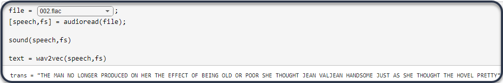
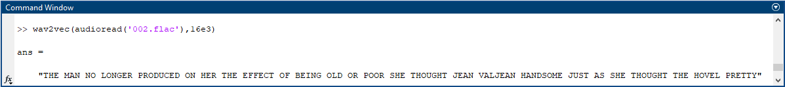
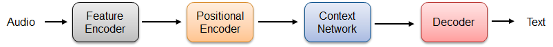
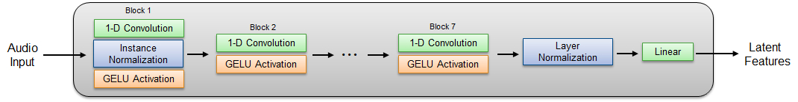
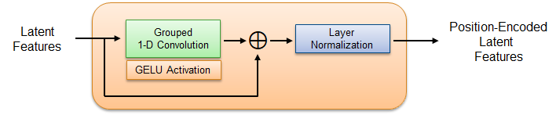
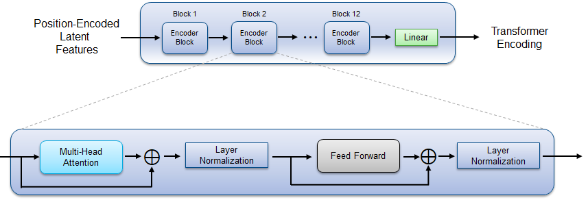
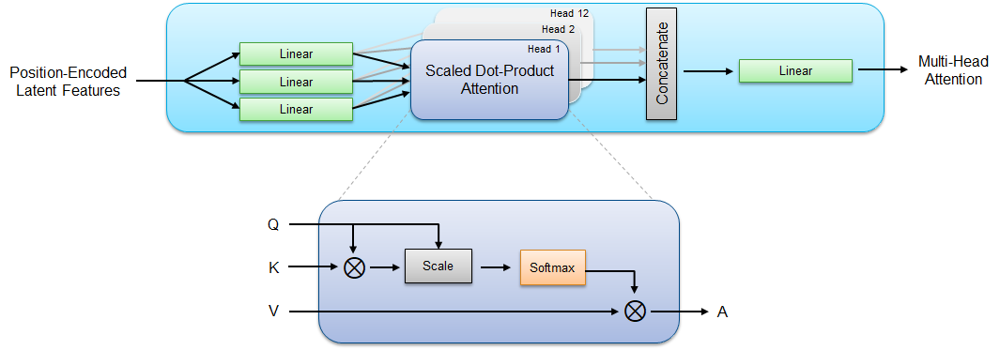

# Speech-to-Text Transcription Using wav2vec 2.0

This repo enables you to load the pretrained wav2vec 2.0 baseline 960 hours model into MATLAB and perform speech-to-text transcription [[1]](#References).

**Creator**: MathWorks Development

## Requirements
- [MATLAB&reg;](http://www.mathworks.com) R2021b or later
- [Deep Learning Toolbox&trade;](https://www.mathworks.com/products/deep-learning.html)
- [Audio Toolbox&trade;](https://www.mathworks.com/products/audio.html)

To accelerate transcription, a GPU and the following toolbox is recommended:

- [Parallel Computing Toolbox&trade;](https://www.mathworks.com/products/parallel-computing.html)

## Getting Started
Download or clone this repositiory to your machine and open it in MATLAB&reg;.

Run ``speech_to_text_using_wav2vec.mlx`` to perform speech-to-text conversion on a specified audio file. The script plays the audio file to your default sound card and returns the text.

You can step through the script to examine the structure of the wav2vec 2.0 model.

You can also use the ``wav2vec.p`` file as a portable implementation of the wav2vec 2.0 model.

## Network Details
The model provided in this example corresponds to the inference-only wav2vec 2.0 base model with the 960 hours finetuning split. It was trained using the LibriSpeech dataset [[2]](#References).
The wav2vec 2.0 inference path consists of a feature encoder, a positional encoder, a context network, and a decoder. You can step through the ``speech_to_text_using_wav2vec.mlx`` file to examine the structure of each module.

### Feature Encoding
The feature encoder passes raw audio input through seven 1-D convolutional blocks. The first block includes an instance (channel-wise) normalization layer between the convolution and GELU activation layers. The output of the convolutional blocks is passed through layer normalization. The total context of the encoder receptive field is 400 samples which corresponds to 25 ms at the 16 kHz input sample rate.

### Positional Encoding
The positional encoder passes the latent features through grouped 1-D convolution to create a relative positional vector which is then added to the latent features to encode the position of the features relative to one another.

### Transformer Encoding
The context network applies twelve encoder blocks in sequence. Each block applies multi-head attention and feed forward blocks in sequence. The feedforward block consists of two fully-connected layers separated by a GELU layer.

#### Multi-Head Attention
Each block of the context network has three linear (fully-connected) layers which output the Q (query), K (key), and V (value) vectors. The Q, K, and V vectors are then chunked into twelve (the number of heads in the system) non-overlapping sections. Scaled dot-product attention is applied to each chunk individually and the results are concatenated. The output is passed through a linear layer to form multi-head attention.

### Text Decoding
Text decoding is performed using a greedy decoding algorithm to sample the most probable tokens at each time step. Since the model is trained using connectionist temporal classification (CTC), post-procesing is required to remove duplicated blank tokens. This is the simplest decoding method and includes a minimalist language model.

## Metrics and Evaluation
### Accuracy Metrics
Accuracy metrics are as reported in [[1]](#References).
| Model | Unlabeled Data | Language Model | dev-clean (WER)  | dev-other (WER) | test-clean (WER) | test-other (WER) |
|:-----:|:--------------:|:--------------:|:----------------:|:---------------:|:----------------:|:----------------:|
| BASE  | LS-960         | None           | 3.2              | 8.9             | 3.4              | 8.5              |

WER = word error rate

### Size
The total size of the model is 236 MB.

## License
The license is available in the [License.txt](License.txt) file in this repository.

## References
[1] Alexei Baevski, Henry Zhou, Abdelrahman Mohamed, and Michael Auli. wav2vec 2.0: A framework for self-supervised learning of speech representations. arXiv preprint arXiv:2006.11477, 2020.

[2] Panayotov, Vassil, Guoguo Chen, Daniel Povey, and Sanjeev Khudanpur. "Librispeech: An ASR Corpus Based on Public Domain Audio Books." In 2015 IEEE International Conference on Acoustics, Speech and Signal Processing (ICASSP), 5206–10. South Brisbane, Queensland, Australia: IEEE, 2015. https://doi.org/10.1109/ICASSP.2015.7178964.

Copyright 2021 The MathWorks, Inc.
